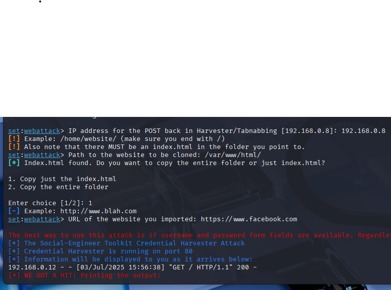
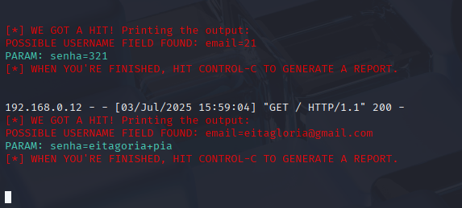

#Passos feitos para a criação do phishing com kali linux

### Ferramentas utilizadas

- Kali Linux (virtualbox)
- setoolkit
- vscode (editor de código)

### Passo a Passo

- Acesso root: ``` sudo su ```
- [1] Social-Engineering Attacks
- [2] Website Attack Vectors
- [3] Credential Harvester Attack Method
- [3] Custom Import
- Obtendo o endereço da máquina: ``` ip a ```
  Eu utilizei uma página personalizada de login do facebook, que criei em /var/www/html/index.php
  

outras imagens interessantes:
<br>
  
  


